# Distribox

<div align="center">
  
</div>

Distribox is a self-hosted platform for creating, managing, and sharing virtual machines through a simple web interface.

<div align="center">
  <a href="https://youtu.be/eH6qJUTcxvI" target="_blank">
    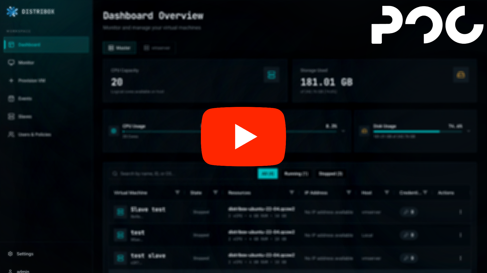
  </a>
</div>

## Features

---

## VM Creation and Management
Create virtual machines with custom specs: CPU cores, RAM, disk size, and operating system. Control VMs with start, stop, restart, duplicate, rename, and delete. Connect to any VM directly from your browser.

<div align="center">
  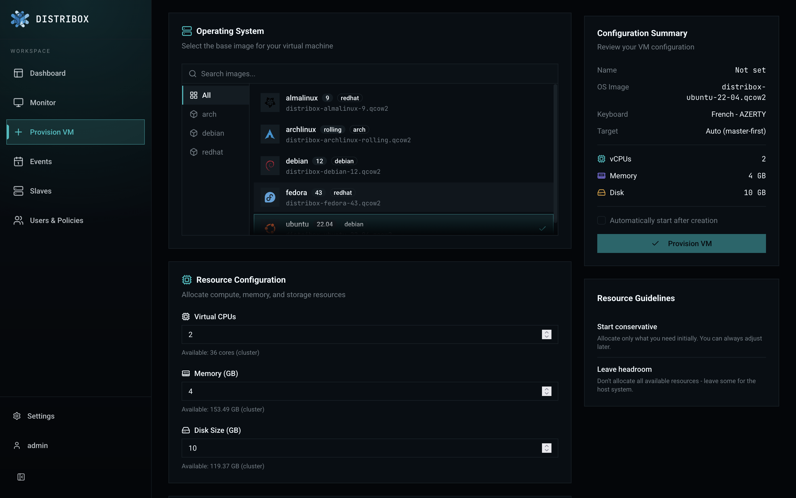
</div>

---

## Graphical VM Streaming
Distribox uses Apache Guacamole to stream VM desktops over WebSocket. The browser connects to the backend, which proxies the Guacamole protocol to guacd, which in turn connects to the VM's VNC server. No client-side software required.

<div align="center">
  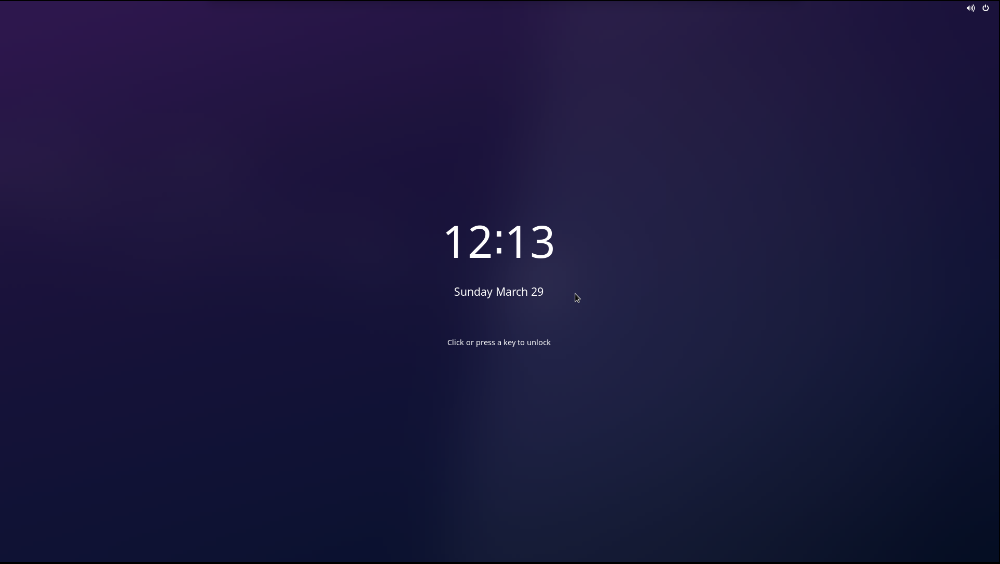
</div>

---

## Authentication and Authorization
VM streaming is secured through authenticated WebSocket tunnels. Access requires either a JWT token with the appropriate policy, or a credential-based token generated per VM. All traffic between the browser and the VM is mediated by the backend.

---

## Policy-Based Access Control
Distribox uses a policy-based permission system similar to RBAC. Each user is assigned one or more policies that grant access to specific actions (creating VMs, managing users, connecting to VMs, viewing metrics, etc.). If a user lacks a policy, the corresponding feature is hidden and access is denied. Admins have full access by default.

<div align="center">
  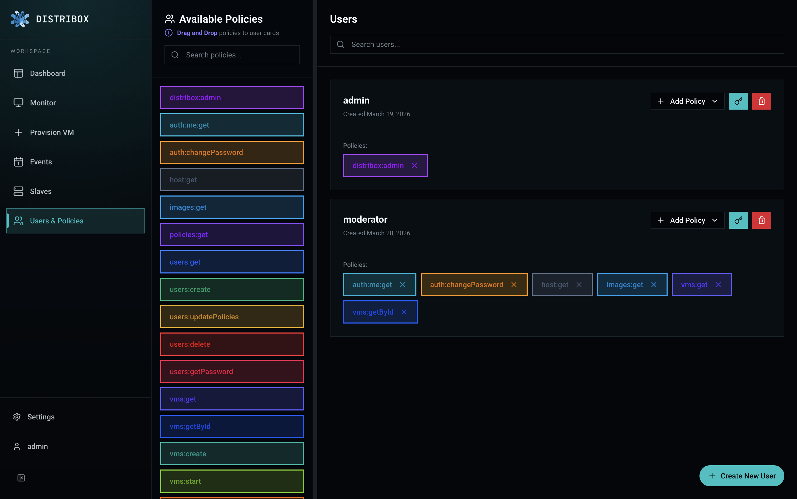
</div>

---

## Wide Range of Operating Systems
Supported out of the box:
- Ubuntu 22.04
- Debian 12
- Fedora 43
- CentOS 10
- AlmaLinux 9
- Alpine Linux 3.21
- Arch Linux (rolling)

---

## Distribox Image Registry
OS images are hosted in a remote S3-based registry. When a VM is created, the backend downloads the corresponding image on demand and caches it locally. This keeps the installation lightweight -- no need to bundle large disk images. Image metadata includes revision tracking so updates are fetched automatically.

---

## Master / Slave Architecture
Distribox supports a distributed setup where additional machines act as slave nodes. The master coordinates VM placement and proxies operations to slaves. Slaves report resource availability via periodic heartbeats, and the master routes new VMs to the node with the most available memory. The frontend includes a guided tutorial for registering slave nodes.

<div align="center">
  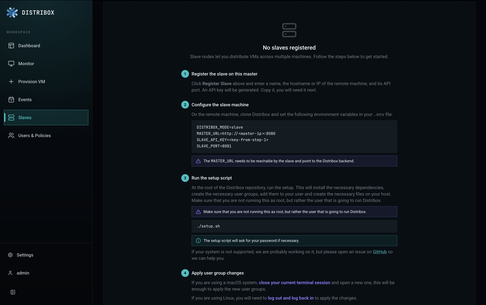
</div>

Once connected, each slave node reports its status and resource usage in realtime.

<div align="center">
  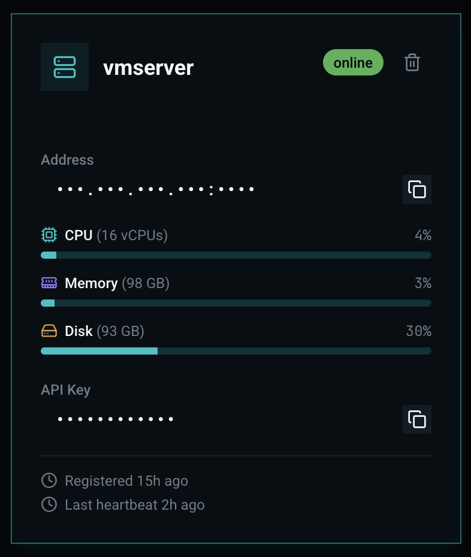
</div>

---

## Realtime Host Metrics
Monitor CPU, memory, and disk usage for the master node, individual slave nodes, or the entire cluster from the dashboard. When provisioning a VM, you can choose which node to deploy on and see its available resources.

<div align="center">
  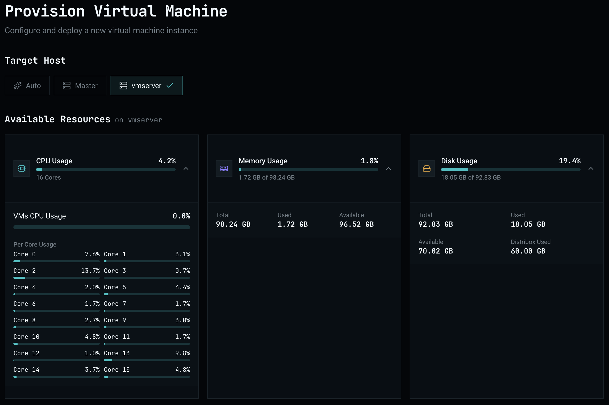
</div>

---

## VM Monitor
The monitor view displays periodical screenshots of all virtual machines on the instance. Running VMs show a live preview, and you can click on any of them to connect directly.

<div align="center">
  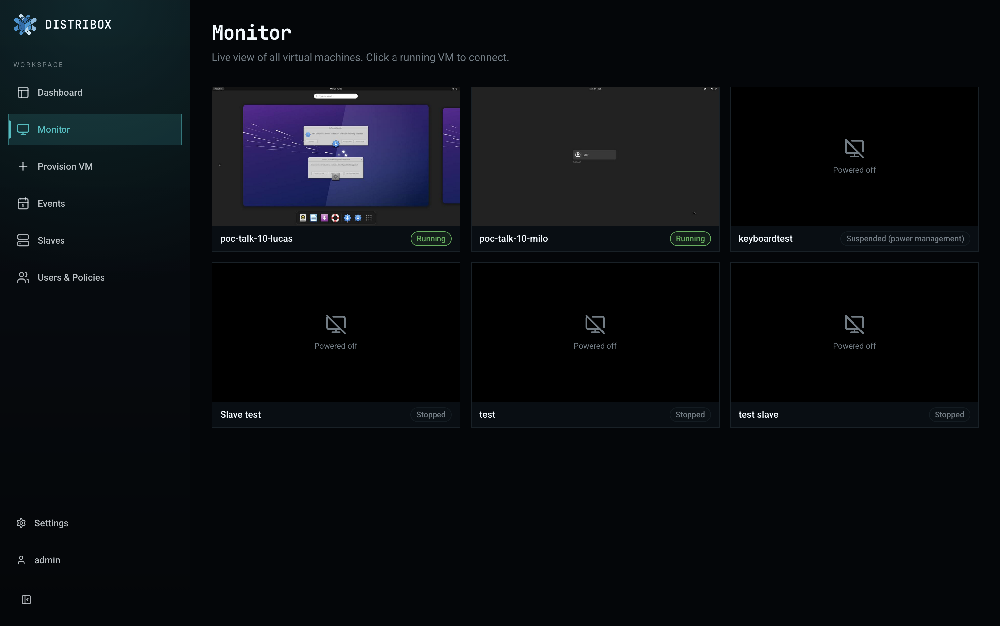
</div>

---

## Events
Events let you distribute a fixed number of VMs with a predefined spec to participants for a set duration. Create an event by choosing an OS, resource allocation, participant limit, and deadline. A shareable link is generated that participants can use to claim their VM.

<div align="center">
  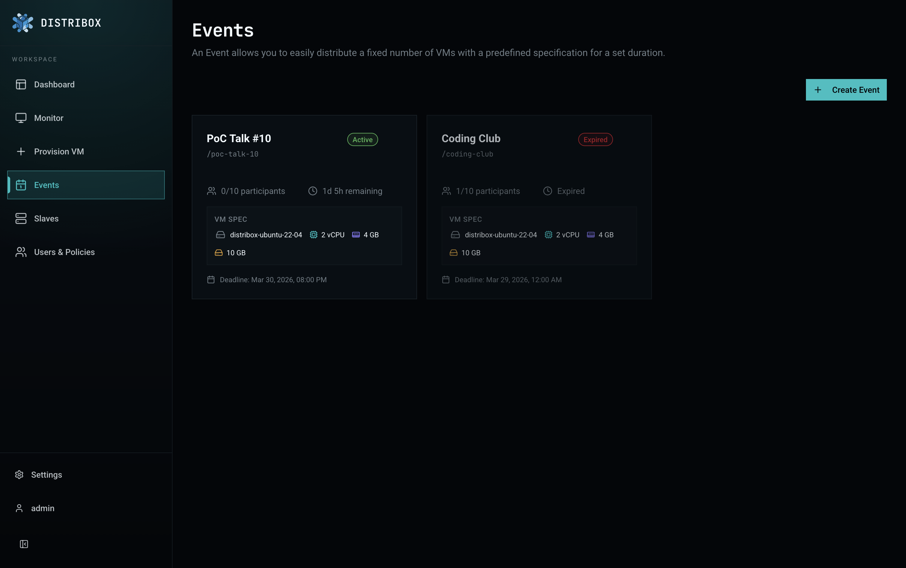
</div>

Each event page shows its details, the provisioned VMs with live previews, and the list of participants.

<div align="center">
  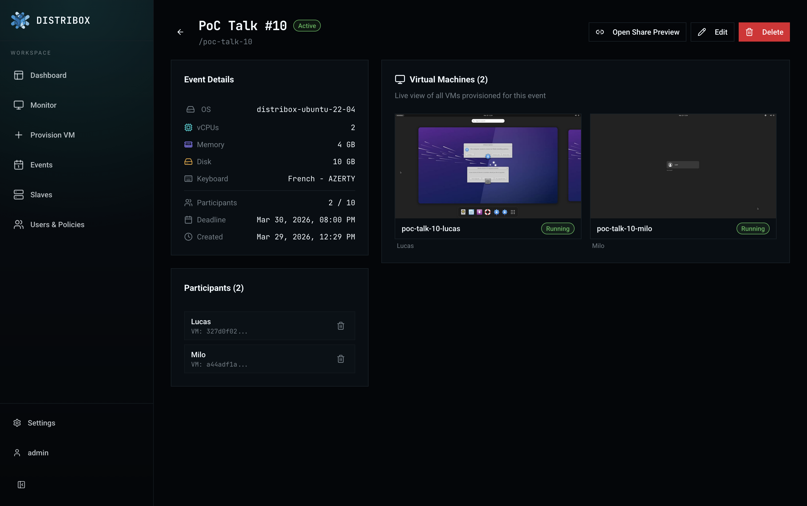
</div>

The share link can be previewed and copied directly from the dashboard.

<div align="center">
  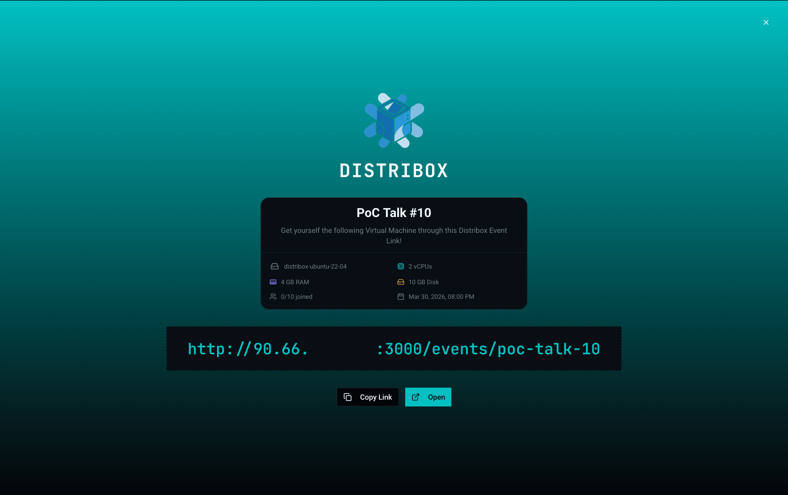
</div>

When an event reaches its deadline, the share link stops working, all VM credentials are revoked, and every virtual machine linked to the event is stopped automatically.

---

## Quickstart

```bash
bash setup.sh

cp .env.example .env

docker compose --profile master up -d --build
```

The application will be available at `localhost:3000`.

For development with hot-reloading:

```bash
docker compose --profile dev up --build
```

To run a slave node on another machine, use the `slave` and follow the guide on the frontend:

## Configuration

Copy `.env.example` to `.env` and adjust as needed. Key variables:

| Variable | Default | Description |
|----------|---------|-------------|
| `DISTRIBOX_MODE` | `master` | `master` or `slave` |
| `MASTER_URL` | - | URL of the master (slave mode only) |
| `SLAVE_API_KEY` | - | API key for slave authentication |
| `ADMIN_USERNAME` | `admin` | Default admin username |
| `ADMIN_PASSWORD` | `admin` | Default admin password |
| `DISTRIBOX_SECRET` | `secret` | Encryption key for sensitive data |
| `BACKEND_PORT` | `8080` | Backend API port |
| `VITE_PORT` | `3000` | Frontend port |

## Deployment

### Reverse Proxy (nginx)

In production, you should place nginx in front of the application to serve both the frontend and backend on a single port. A ready-to-use configuration is provided in [`nginx.conf`](./nginx.conf).

Install it:

```bash
sudo cp nginx.conf /etc/nginx/sites-available/distribox
sudo ln -s /etc/nginx/sites-available/distribox /etc/nginx/sites-enabled/
sudo nginx -t && sudo systemctl reload nginx
```

This configuration:
- Listens on port **80** and routes traffic to the frontend (port 3000) and backend (port 8080)
- Proxies WebSocket connections for VM streaming (`/tunnel`)
- All other backend routes (`/auth`, `/vms`, `/images`, etc.) are forwarded to the API

> Note: If you change port configuration for the deployment, we trust you will update the reverse proxy configuration accordingly.

After enabling the reverse proxy, update your `.env` so the frontend calls the backend through nginx instead of directly:

```env
VITE_API_DOMAIN=http://your-domain.com
FRONTEND_URL=http://your-domain.com
```

### Firewall

VNC servers listen on ports 5900-5999 on the host. These must **not** be exposed to the network -- VM streaming is handled securely through the Guacamole WebSocket tunnel. Block external access with your firewall:

```bash
# ufw
sudo ufw deny 5900:5999/tcp

# or iptables
sudo iptables -A INPUT -p tcp --dport 5900:5999 -j DROP
```

### SSL is STRONGLY RECOMMENDED

Distribox should be served over HTTPS. Without SSL:

- **Clipboard will not work.** The browser Clipboard API (`navigator.clipboard`) is only available in [secure contexts](https://developer.mozilla.org/en-US/docs/Web/API/Clipboard_API#security_considerations) (HTTPS). Copying VM credentials, event links, or any other data from the dashboard will silently fail on plain HTTP.
- **Pasting into VMs will not work.** The Guacamole client uses the Clipboard API to sync your clipboard with the remote VM. Without HTTPS, you will not be able to paste text into a VM session from your browser.

The easiest way to set up SSL is with [Certbot](https://certbot.eff.org/) (Let's Encrypt):

```bash
sudo apt install certbot python3-certbot-nginx
sudo certbot --nginx -d your-domain.com
```

Certbot will automatically modify your nginx configuration to:
- Redirect HTTP (port 80) to HTTPS (port 443)
- Install and renew your TLS certificate

After running Certbot, update your `.env`:

```env
VITE_API_DOMAIN=https://your-domain.com
FRONTEND_URL=https://your-domain.com
```

Certbot sets up automatic renewal via a systemd timer. You can verify it with:

```bash
sudo certbot renew --dry-run
```

## Tech Stack

- **Backend:** FastAPI, SQLModel, PostgreSQL, libvirt, KVM/QEMU
- **Frontend:** React Router v7, TypeScript, TailwindCSS v4, shadcn/ui
- **Streaming:** Apache Guacamole (guacd) over WebSocket
- **Containerization:** Docker Compose

## Get Involved

Check out the [contributing guide](./CONTRIBUTING.md).

If you're interested in how the project is organized at a higher level, contact the current project manager.

### Further Documentation

- [Backend](./backend/README.md) -- environment setup and standalone backend configuration
- [Frontend](./frontend/README.md) -- environment setup and standalone frontend configuration
- [Images](./images/README.md) -- guide for building and customizing OS images
- [Atlas](./atlas/README.md) -- syncing tool to upload images to the Distribox registry

## Our PoC team ❤️

Developers
| [<br><sub>Loan Riyanto</sub>](https://github.com/skl1017)
| :---: |

### Manager
| [<br><sub>Laurent Gonzalez</sub>](https://github.com/lg-epitech) |
| :---: |

<h2 align=center>
Organization
</h2>

<p align='center'>
    <a href="https://www.linkedin.com/company/pocinnovation/mycompany/">
        
    </a>
    <a href="https://www.instagram.com/pocinnovation/">
        
    </a>
    <a href="https://twitter.com/PoCInnovation">
        
    </a>
    <a href="https://discord.com/invite/Yqq2ADGDS7">
        
    </a>
</p>
<p align=center>
    <a href="https://www.poc-innovation.fr/">
        
    </a>
</p>

> 🚀 Don't hesitate to follow us on our different networks, and put a star 🌟 on `PoC's` repositories

> Made with ❤️ by PoC
