# Distribox

<div align="center">
  
</div>

Distribox is a self-hosted platform for creating, managing, and sharing virtual machines through a simple web interface.

<div align="center">
  <a href="https://youtu.be/eH6qJUTcxvI" target="_blank">
    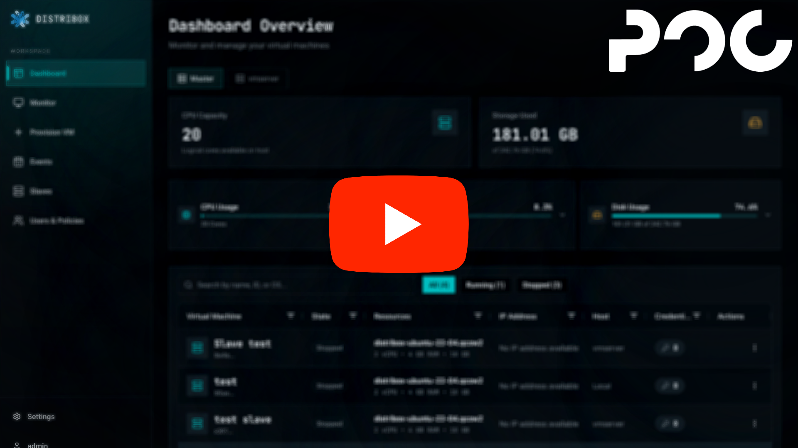
  </a>
</div>

## Features

---

## VM Creation and Management
Create virtual machines with custom specs: CPU cores, RAM, disk size, and operating system. Control VMs with start, stop, restart, duplicate, rename, and delete. Connect to any VM directly from your browser.

<div align="center">
  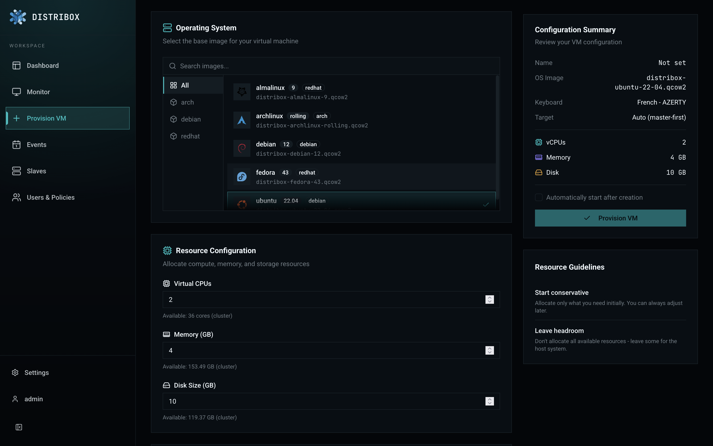
</div>

---

## Graphical VM Streaming
Distribox uses Apache Guacamole to stream VM desktops over WebSocket. The browser connects to the backend, which proxies the Guacamole protocol to guacd, which in turn connects to the VM's VNC server. No client-side software required.

<div align="center">
  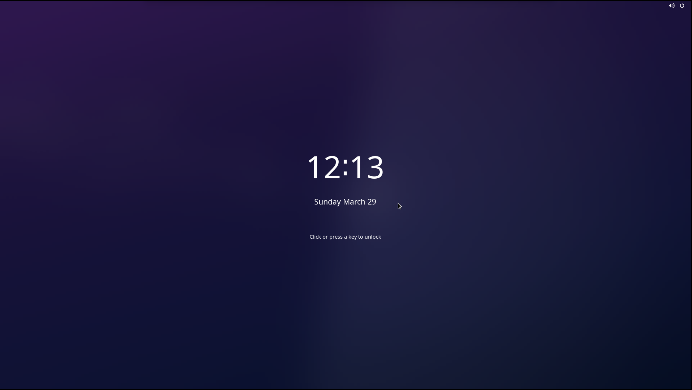
</div>

---

## Authentication and Authorization
VM streaming is secured through authenticated WebSocket tunnels. Access requires either a JWT token with the appropriate policy, or a credential-based token generated per VM. All traffic between the browser and the VM is mediated by the backend.

---

## Native SSH

Hosts can enable **Allow SSH** for a VM or an event. Recipients then see an **SSH** button beside the web client, with a command to copy, their access secret, and the gateway fingerprint. No additional client software is required beyond an SSH client.

```bash
ssh -p 2222 <credential-id>@distribox.example.com
```

Paste the VM access secret at the password prompt. The gateway supports interactive terminals, remote commands, and SFTP, including modern `scp`. It connects only to the VM assigned to that credential. Disabling SSH, revoking the credential, or reaching its expiry or event deadline closes existing SSH connections within five seconds. SSH port forwarding, agent forwarding, and X11 forwarding are disabled.

SSH is disabled by default. The `vms:ssh:manage` policy controls the host switch; event changes apply to existing and future participant VMs. Duplicated and recovered VMs start with SSH disabled.

---

## Policy-Based Access Control
Distribox uses a policy-based permission system similar to RBAC. Each user is assigned one or more policies that grant access to specific actions (creating VMs, managing users, connecting to VMs, viewing metrics, etc.). If a user lacks a policy, the corresponding feature is hidden and access is denied. Admins have full access by default.

<div align="center">
  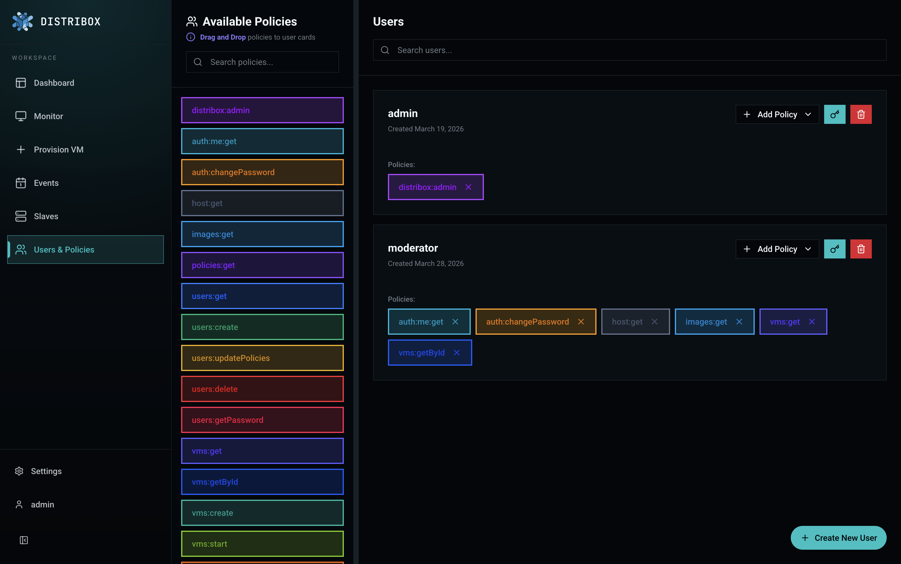
</div>

---

## Wide Range of Operating Systems
Supported out of the box:
- Ubuntu 22.04
- Debian 12
- Fedora 43
- CentOS 10
- AlmaLinux 9
- Alpine Linux 3.21
- Arch Linux (rolling)

---

## Distribox Image Registry
OS images are hosted in a remote S3-based registry. When a VM is created, the backend downloads the corresponding image on demand and caches it locally. This keeps the installation lightweight -- no need to bundle large disk images. Image metadata includes revision tracking so updates are fetched automatically.

---

## Master / Slave Architecture
Distribox supports a distributed setup where additional machines act as slave nodes. The master coordinates VM placement and proxies operations to slaves. Slaves report resource availability via periodic heartbeats, and the master routes new VMs to the node with the most available memory. The frontend includes a guided tutorial for registering slave nodes.

<div align="center">
  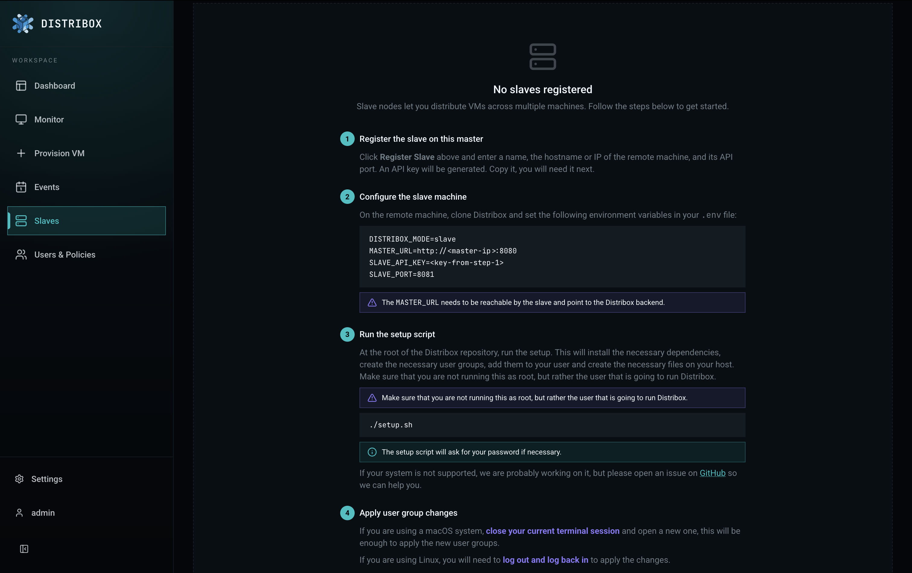
</div>

Once connected, each slave node reports its status and resource usage in realtime.

<div align="center">
  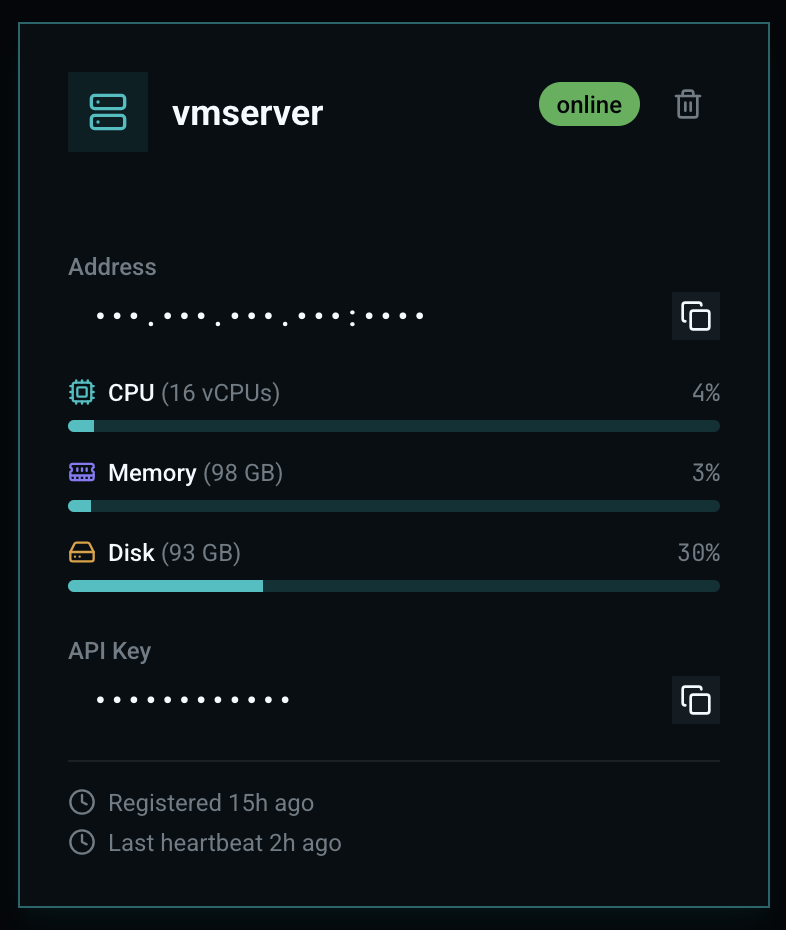
</div>

---

## Realtime Host Metrics
Monitor CPU, memory, and disk usage for the master node, individual slave nodes, or the entire cluster from the dashboard. When provisioning a VM, you can choose which node to deploy on and see its available resources.

<div align="center">
  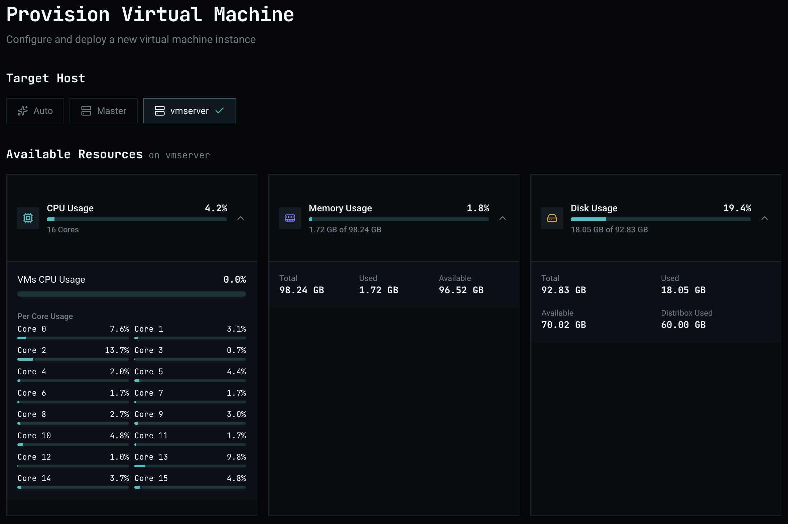
</div>

---

## VM Monitor
The monitor view displays periodical screenshots of all virtual machines on the instance. Running VMs show a live preview, and you can click on any of them to connect directly.

<div align="center">
  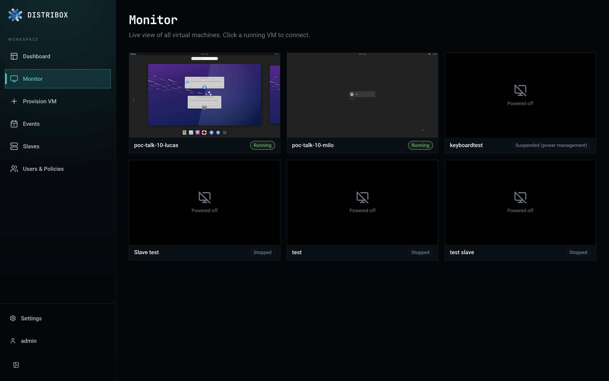
</div>

---

## Events
Events let you distribute a fixed number of VMs with a predefined spec to participants for a set duration. Create an event by choosing an OS, resource allocation, participant limit, and deadline. A shareable link is generated that participants can use to claim their VM.

<div align="center">
  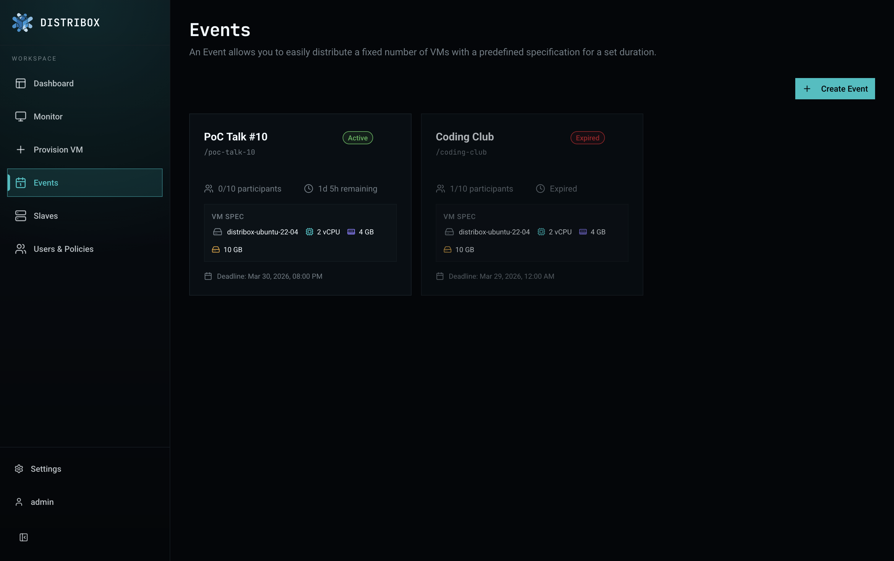
</div>

Each event page shows its details, the provisioned VMs with live previews, and the list of participants.

<div align="center">
  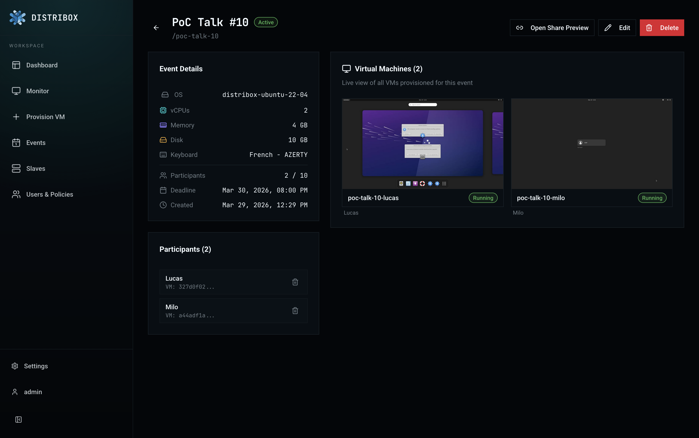
</div>

The share link can be previewed and copied directly from the dashboard.

<div align="center">
  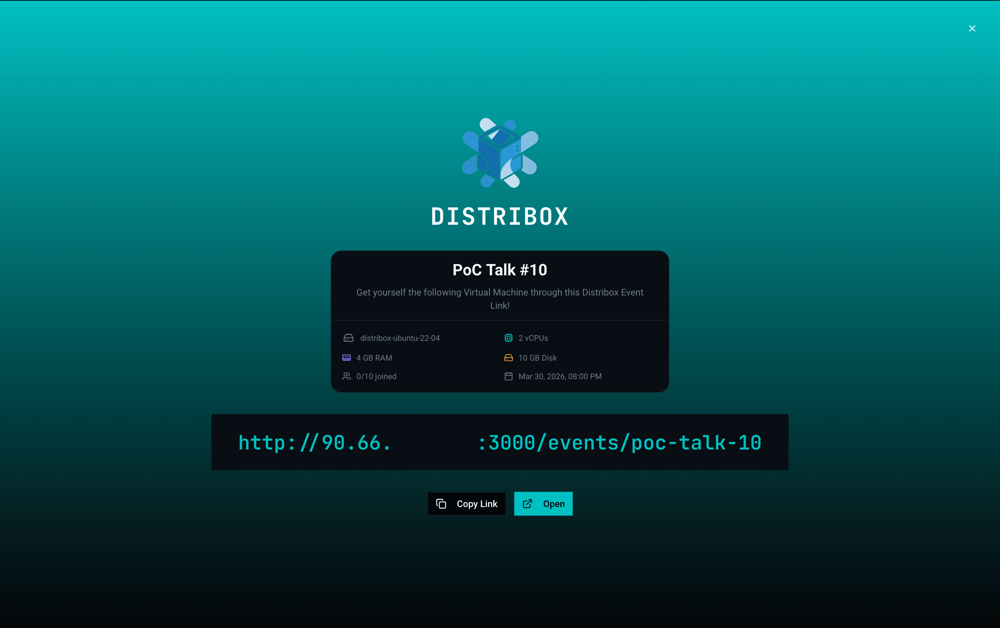
</div>

When an event reaches its deadline, the share link stops working, all VM credentials are revoked, and every virtual machine linked to the event is stopped automatically.

---

## Quickstart

To keep VM data on another partition, follow the [storage setup](#store-vm-data-on-another-partition) after `setup.sh` and before starting Compose.

```bash
bash setup.sh

cp .env.example .env

docker compose --profile master up -d --build
```

The application will be available at `localhost:3000`.

For development with hot-reloading:

```bash
docker compose --profile dev up --build
```

To run a slave node on another machine, use the `slave` and follow the guide on the frontend:

### Store VM data on another partition

If the system partition is nearly full and `/data` has room, store Distribox's data in `/data/distribox` and **bind mount that directory at `/var/lib/distribox` on the host**. Downloaded images, VM disks, and the SSH gateway key then live on `/data`. The application and host libvirt keep using their existing paths, so existing VM definitions remain valid.

Keep the Compose volume `/var/lib/distribox:/var/lib/distribox` unchanged. Mapping `/data/distribox` directly to `/var/lib/distribox` only inside Docker would leave host libvirt looking at the wrong files. This is a one-time host configuration: users create VMs normally, with no partition picker or additional service. Configure each master or slave host separately. The database's Docker volume is unaffected.

The instructions below assume Linux with systemd, native Docker Engine, and an existing writable partition mounted at `/data`. Use a filesystem that supports Unix permissions and sparse files, such as ext4 or XFS. They do not format or repartition disks. For a fresh installation, run `bash setup.sh` and configure `.env` as in the Quickstart, then follow these steps before starting Compose. For an existing installation, arrange downtime and back up the data first. Run each step only after the preceding one succeeds.

If you previously used the experimental partition-management feature, do not apply this migration to an installation with additional storage pools in `storage.json` or mounts below `/var/lib/distribox`. Those pools and their VM records require a separate migration. A running experimental `distribox-storage` service must also be removed from the host before using this configuration.

1. **Check the source partition and available space.** `/data` must already have a persistent mount entry in `/etc/fstab`, preferably identified by filesystem UUID. Confirm its device is the intended partition, rather than the system filesystem:

   ```bash
   findmnt --mountpoint /data
   df -h /data /var/lib/distribox
   sudo du -sh /var/lib/distribox
   ```

   Stop if `/data` is not mounted. The destination `/data/distribox` and backup path `/var/lib/distribox.before-storage-move` must not already exist. Also check `findmnt --mountpoint /var/lib/distribox`: these migration commands expect an ordinary source directory, not an existing mount point.

2. **Stop writes before copying.** For an existing installation, stop the backend, then gracefully shut down every Distribox VM using its ID:

   ```bash
   docker compose --profile master stop backend
   sudo virsh -c qemu:///system list --all
   sudo virsh -c qemu:///system shutdown VM_ID
   ```

   Replace `VM_ID` with the VM's ID, repeat for each running Distribox VM, and wait until each reports `shut off` in `virsh list --all`. Stopping Docker does **not** stop VMs running under host libvirt. Resume paused VMs with `sudo virsh -c qemu:///system resume VM_ID` before requesting shutdown. Leave the backend stopped throughout the copy and mount change. For development, substitute profile `dev` and service `backend-dev`; for a slave, use profile `slave` and service `slave` in the Compose commands throughout this guide.

3. **Copy and verify the data.** Install `rsync` if needed. These options preserve sparse disk images, owners, permissions, hard links, ACLs, and extended attributes:

   ```bash
   sudo mkdir /data/distribox
   sudo rsync -aHAXS --numeric-ids /var/lib/distribox/ /data/distribox/
   sudo rsync -aHAXScn --numeric-ids --itemize-changes /var/lib/distribox/ /data/distribox/
   ```

   The final command checks file contents without changing anything; it should report no differences. Resolve any errors before continuing. Keep the original directory as a temporary rollback copy, using an unused backup path:

   ```bash
   sudo mv -T /var/lib/distribox /var/lib/distribox.before-storage-move
   sudo install -d -m 755 /var/lib/distribox
   ```

4. **Make the host mount persistent and order startup.** Back up `/etc/fstab`, then add this line with `sudoedit /etc/fstab`:

   ```fstab
   /data/distribox /var/lib/distribox none bind,x-systemd.requires=data.mount 0 0
   ```

   The explicit dependency requires `/data` to be mounted before the bind mount. Do not add `nofail` to these storage mounts. With `sudo systemctl edit docker.service` and `sudo systemctl edit libvirtd.service`, add this drop-in to **both** services:

   ```ini
   [Unit]
   Requires=var-lib-distribox.mount
   After=var-lib-distribox.mount
   ```

   These dependencies prevent startup against an empty directory on the system disk when the data mount is unavailable. They apply to all workloads managed by those Docker and libvirt services. Hosts using the modular libvirt daemons should apply the libvirt drop-in to `virtqemud.service` instead. For another mount path, adjust the mount unit names with `systemd-escape --path --suffix=mount /your/path`.

   Load the configuration and mount the directory:

   ```bash
   sudo findmnt --verify --verbose
   sudo systemctl daemon-reload
   sudo systemctl start var-lib-distribox.mount
   findmnt --mountpoint /var/lib/distribox
   df -h /data /var/lib/distribox
   ```

   Both paths must now report the capacity of the data partition. Files in `/var/lib/distribox/images` and `/var/lib/distribox/vms` must match their counterparts under `/data/distribox`.

5. **Recreate the backend and verify it before starting VMs.** Existing containers can retain the previous directory mount; recreate them after the host mount is in place:

   ```bash
   docker compose --profile master up -d --force-recreate backend
   docker compose --profile master exec backend df -h /var/lib/distribox
   docker compose --profile master exec backend ls /var/lib/distribox/images /var/lib/distribox/vms
   ```

   For a fresh installation, start the full application with `docker compose --profile master up -d --build` as in the Quickstart. Confirm the container reports the data partition's capacity and the expected files. Start a VM and check that it works, then verify a new VM and its downloaded image appear under `/data/distribox`. On hosts with custom AppArmor or SELinux policies, preserve the copied security attributes and resolve any access denials through the host's policy; do not make the directories world-writable.

The rollback copy at `/var/lib/distribox.before-storage-move` still consumes system-disk space. Keep it until verification succeeds; then archive it elsewhere or deliberately remove **that backup directory only** to reclaim the space. Do not leave the original files hidden underneath the new mount. Continue backing up `/data/distribox`, the database, and the installation's encryption secret. Verify mount ordering after the next planned reboot.

To roll back before any data changes, stop the backend and all Distribox VMs again, stop `var-lib-distribox.mount`, remove the added fstab entry and the dependency lines added to the service overrides, and reload systemd. Preserve any unrelated service overrides. Stopping the required mount also stops Docker and libvirt services, so schedule this for the whole host. Remove the now-empty `/var/lib/distribox` mount point with `rmdir`, rename the backup directory to `/var/lib/distribox`, restart the host services, and recreate the backend. If VMs or images changed after migration, the backup is stale: preserve and copy back the current data while everything is stopped before switching paths.

See the [systemd mount documentation](https://www.freedesktop.org/software/systemd/man/latest/systemd.mount.html) for boot dependencies and [Docker bind mount documentation](https://docs.docker.com/engine/storage/bind-mounts/) for container mount behavior.

## Configuration

Copy `.env.example` to `.env` and adjust as needed. Key variables:

| Variable | Default | Description |
|----------|---------|-------------|
| `DISTRIBOX_MODE` | `master` | `master` or `slave` |
| `MASTER_URL` | - | URL of the master (slave mode only) |
| `SLAVE_API_KEY` | - | API key for slave authentication |
| `ADMIN_USERNAME` | `admin` | Default admin username |
| `ADMIN_PASSWORD` | `admin` | Default admin password |
| `DISTRIBOX_SECRET` | `secret` | Encryption key for sensitive data |
| `BACKEND_PORT` | `8080` | Backend API port |
| `VITE_PORT` | `3000` | Frontend port |

## Deployment

### Reverse Proxy (nginx)

In production, you should place nginx in front of the application to serve both the frontend and backend on a single port. A ready-to-use configuration is provided in [`nginx.conf`](./nginx.conf).

Install it:

```bash
sudo cp nginx.conf /etc/nginx/sites-available/distribox
sudo ln -s /etc/nginx/sites-available/distribox /etc/nginx/sites-enabled/
sudo nginx -t && sudo systemctl reload nginx
```

This configuration:
- Listens on port **80** and routes traffic to the frontend (port 3000) and backend (port 8080)
- Proxies WebSocket connections for VM streaming (`/tunnel`)
- All other backend routes (`/auth`, `/vms`, `/images`, etc.) are forwarded to the API

> Note: If you change port configuration for the deployment, we trust you will update the reverse proxy configuration accordingly.

After enabling the reverse proxy, update your `.env` so the frontend calls the backend through nginx instead of directly:

```env
VITE_API_DOMAIN=http://your-domain.com
FRONTEND_URL=http://your-domain.com
```

### Firewall

VNC servers listen on ports 5900-5999 on the host. These must **not** be exposed to the network -- VM streaming is handled securely through the Guacamole WebSocket tunnel. Block external access with your firewall:

```bash
# ufw
sudo ufw deny 5900:5999/tcp

# or iptables
sudo iptables -A INPUT -p tcp --dport 5900:5999 -j DROP
```

### SSH gateway

Set these values in `.env`, then rebuild the backend:

```env
SSH_ENABLED=true
SSH_PORT=2222
SSH_PUBLIC_HOST=distribox.example.com
```

`SSH_PUBLIC_HOST` is the hostname recipients connect to; it defaults to the hostname in `FRONTEND_URL`. Set `SSH_PUBLIC_PORT` only when an external port mapping differs from `SSH_PORT`. The backend uses host networking to reach guests behind libvirt NAT; it listens directly on the configured API and SSH ports. Allow the SSH TCP port through the host firewall; the HTTP reverse proxy does not carry native SSH traffic. The default database hostname is mapped to localhost inside backend containers, where Compose publishes PostgreSQL. Custom database hostnames continue to work.

SSH requires a unique `DISTRIBOX_SECRET` of at least 32 characters on the master and each slave serving SSH VMs. For a new installation, generate one with `openssl rand -hex 32`. Keep existing encryption secrets when upgrading: replacing `DISTRIBOX_SECRET` makes previously encrypted credentials unreadable. Back up `/var/lib/distribox/ssh/host_key`, the per-VM directories, and the encryption secret. The persistent gateway key keeps the fingerprint stable across restarts.

Guests need OpenSSH server, the `user` account, a running QEMU guest agent with `guest-exec` enabled, and an IPv4 DHCP lease on a libvirt-managed network. Updated image builders include OpenSSH. For older or custom images, install and enable those services through the web client first. The gateway prepares a separate key for each VM on its first SSH connection, disables guest password and root SSH login, and verifies guest host keys through the guest agent. Guest keys stay on the server; the browser receives no private key or guest password. The web console login is unchanged.

Slave connections use the existing authenticated management API and a private WebSocket relay. Keep master-to-slave traffic on a trusted, isolated network or an encrypted network tunnel: the current management API uses HTTP and carries both its API token and SSH preparation secrets. Only the master's SSH gateway port needs to be publicly reachable.

New event and VM access secrets use 32 random bytes. Credential IDs alone no longer authorize web connections; share links must contain the access secret. JWT signing now derives a separate signing key from `DISTRIBOX_SECRET` unless `JWT_SECRET_KEY` is explicitly set. Users with sessions signed by the previous default key must log in again. An explicit JWT key must also contain at least 32 characters when SSH is enabled.

### SSL is STRONGLY RECOMMENDED

Distribox should be served over HTTPS. Without SSL:

- **Clipboard will not work.** The browser Clipboard API (`navigator.clipboard`) is only available in [secure contexts](https://developer.mozilla.org/en-US/docs/Web/API/Clipboard_API#security_considerations) (HTTPS). Copying VM credentials, event links, or any other data from the dashboard will silently fail on plain HTTP.
- **Pasting into VMs will not work.** The Guacamole client uses the Clipboard API to sync your clipboard with the remote VM. Without HTTPS, you will not be able to paste text into a VM session from your browser.

The easiest way to set up SSL is with [Certbot](https://certbot.eff.org/) (Let's Encrypt):

```bash
sudo apt install certbot python3-certbot-nginx
sudo certbot --nginx -d your-domain.com
```

Certbot will automatically modify your nginx configuration to:
- Redirect HTTP (port 80) to HTTPS (port 443)
- Install and renew your TLS certificate

After running Certbot, update your `.env`:

```env
VITE_API_DOMAIN=https://your-domain.com
FRONTEND_URL=https://your-domain.com
```

Certbot sets up automatic renewal via a systemd timer. You can verify it with:

```bash
sudo certbot renew --dry-run
```

## Tech Stack

- **Backend:** FastAPI, SQLModel, PostgreSQL, libvirt, KVM/QEMU
- **Frontend:** React Router v7, TypeScript, TailwindCSS v4, shadcn/ui
- **Streaming:** Apache Guacamole (guacd) over WebSocket
- **Containerization:** Docker Compose

## Get Involved

Check out the [contributing guide](./CONTRIBUTING.md).

If you're interested in how the project is organized at a higher level, contact the current project manager.

### Further Documentation

- [Backend](./backend/README.md) -- environment setup and standalone backend configuration
- [Frontend](./frontend/README.md) -- environment setup and standalone frontend configuration
- [Images](./images/README.md) -- guide for building and customizing OS images
- [Atlas](./atlas/README.md) -- syncing tool to upload images to the Distribox registry

## Our PoC team ❤️

Developers
| [<br><sub>Loan Riyanto</sub>](https://github.com/skl1017)
| :---: |

### Manager
| [<br><sub>Laurent Gonzalez</sub>](https://github.com/lg-epitech) |
| :---: |

<h2 align=center>
Organization
</h2>

<p align='center'>
    <a href="https://www.linkedin.com/company/pocinnovation/mycompany/">
        
    </a>
    <a href="https://www.instagram.com/pocinnovation/">
        
    </a>
    <a href="https://twitter.com/PoCInnovation">
        
    </a>
    <a href="https://discord.com/invite/Yqq2ADGDS7">
        
    </a>
</p>
<p align=center>
    <a href="https://www.poc-innovation.fr/">
        
    </a>
</p>

> 🚀 Don't hesitate to follow us on our different networks, and put a star 🌟 on `PoC's` repositories

> Made with ❤️ by PoC
